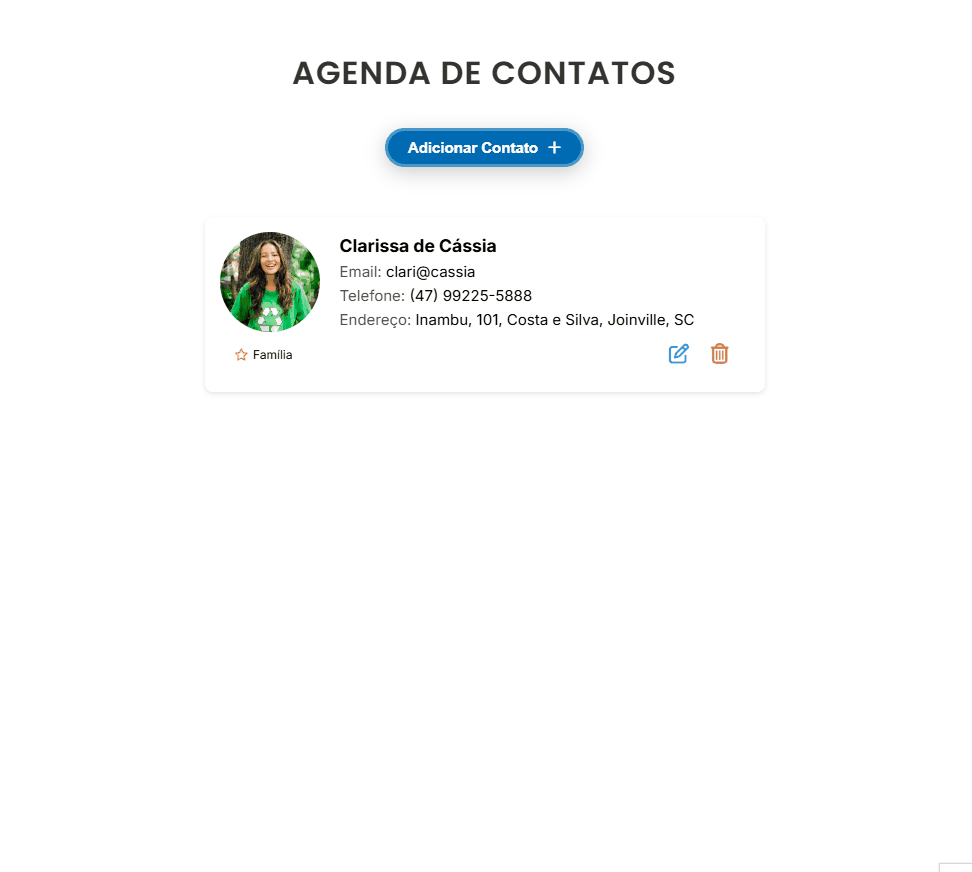

<h1 align="center" fontSize="60px">
 Agenda de Contatos
</p>

<p align="center">
  
</p>

## 💻 Projeto

Agenda de Contatos é uma aplicação simples e intuitiva para armazenar e gerenciar contatos. Ela permite adicionar, visualizar, editar e excluir contatos de maneira prática e eficiente. O frontend foi construído com Vue.js, garantindo uma interface dinâmica e responsiva para uma melhor experiência do usuário.

A aplicação facilita o gerenciamento de contatos, permitindo armazenar e buscar informações essenciais, como nome, telefone, e-mail, endereço, além de classificar os contatos por categorias.

<h2>⚙️ Funcionalidades</h2>
<p>✔ <strong>Adicionar contato</strong>: Cadastrar um novo contato com nome, telefone e e-mail.</p>
<p>✔ <strong>Listar contatos</strong>: Exibir todos os contatos cadastrados de forma organizada.</p>
<p>✔ <strong>Editar contato</strong>: Atualizar as informações de um contato existente.</p>
<p>✔ <strong>Excluir contato</strong>: Remover um contato da agenda.</p>
<p>✔ <strong>Pesquisar contato</strong>: Buscar um contato pelo nome ou pela categoria.</p>
<p>✔ <strong>Mensagens de feedback</strong>: Exibir alertas para ações realizadas, como sucesso ao cadastrar ou erro ao tentar excluir um contato inexistente.</p>

## 🛠️ Ferramentas Utilizadas

- [Vue.js](https://vuejs.org/)
- [Axios](https://axios-http.com/ptbr/docs/intro)
- [CSS](https://developer.mozilla.org/pt-BR/docs/Web/CSS)

## 📥 Passo a Passo  para instalação e execução

 **Pré-requisitos:**

- Vs Code
- Node.js instalado (Para que o projeto rode localmente, será necessário ter o  com VSCode instalado.)
- Git Bash - Ferramenta de versionamento
- Npm ou Yarn - Controle de pacotes

 **1. Clone o Repositório:**
   Dentro da pasta onde deseja salvar o projeto, abra o git e efetuar o comando

   ```bash
   git clone https://github.com/ClariCassia/agenda-contatos-vue.git
   
   ```

 **2. Acesse o Diretório:**

   ```bash
   cd nome-do-projeto
   ```

 **3. Instale as Dependências:**

   ```bash
   npm install   # ou yarn install, conforme sua prefêrencia
   ```

 **4. Execute a Aplicação:**

   ```bash
   npm run dev  # ou yarn start
   ```


## 🤝 Contribuições

Se quiser contribuir para este projeto, siga estes passos:

Faça o `fork` e clone o projeto a partir do seu usuário.

```bash
# Clonando projeto
$ git clone https://github.com/SEU-NOME-DE-USUARIO/agenda-contatos-vue.git


# Criando um branch
$ git branch minha-alteracao

# Acessando o novo branch
$ git checkout -b minha-alteracao

# Adicionando os arquivos alterados
$ git add .

# Criando commit e a mensagem
$ git commit -m "Add nova funcionalidade"

# Enviando alterações para o brach
$ git push origin minha-alteracao
```

Você deve navegar até o seu repositório onde fez o fork e clicar no botão *New pull request* no lado esquerdo da página.

Agradeço antecipadamente pela sua contribuição, juntos podemos tornar este projeto ainda mais incrível! 🙏🌟

Com ❤️ por [Clarissa de Cássia](www.linkedin.com/in/clarissa-cassia-dev-full-stack) 😊
